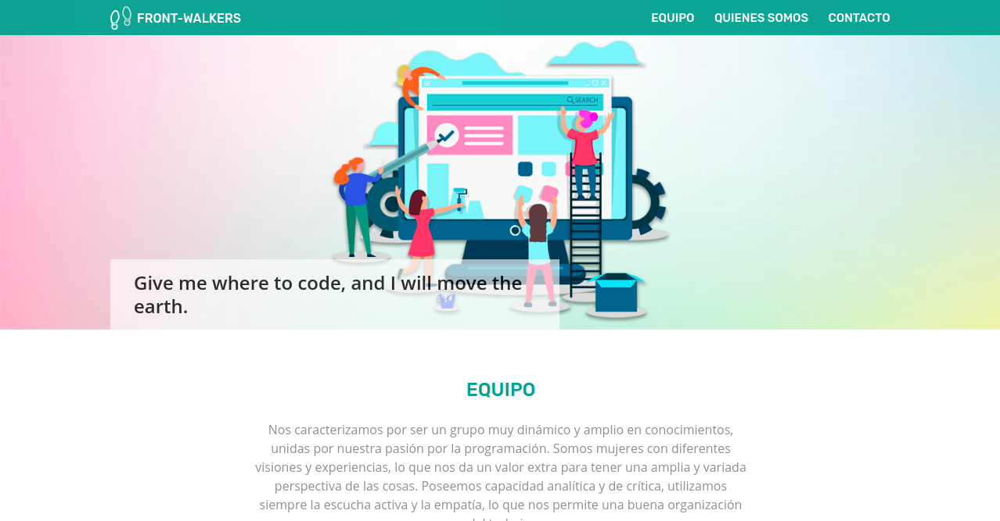

# Contact us!.
Interfaz diseñada para facilitar el contacto de los grupos de trabajo de las adalabers.
Esta se compone de dos pages. La primera tiene:
1. Un header fijo con el logo y el nombre del grupo además de un menú de navegación.
2. Un hero con una imagen de fondo y otra imagen vectorial en representación a las componentes del grupo y nuestro trabajo.
3. Tres secciones principales: una con la descripción de equipo, la segunda con las fortalezas del grupo y las oportunidades que se nos presentan y por último, unas cards con los perfiles de las componentes para conocernos mejor.
4. Un footer con otro menú de navegación, el logo de Adalab enlazando al home y un copyright.

Entre los enlaces de los menús de navegación se encuentra "contacto" que redirige a la segunda page, donde hay un formulario para enviar un mensaje a nuestro correo grupal.

## Guía para usar el repositorio
Necesitarás instalar [Node.js](https://nodejs.org/) y [Gulp](https://gulpjs.com) para trabajar con este repositorio, luego:
1. Descarga o clona el repositorio.
2. Instala las dependencias locales con `npm install`para instalar los paquetes necesarios para convertir Sass a CSS, minizarlo, etc.
3. Arranca el kit con `gulp`

> ### Cada vez que trabajemos con el código:
- Desde nuestra terminal, ejecutamos el comando `gulp` para que realice la tarea por defecto. El `gulpfile.js` estará pendiente de nuestros archivos Sass, html y JavaScript y los compilará, minificará y/o recargará el servidor cada vez que hagamos un cambio.

## Tareas de gulp incluidas
### Inicio de un web server para desarrollo
```
npm start
```
o lo que en este proyecto es lo mismo:

```
gulp
```
Lanza un webserver con BrowserSync y varios watchers estarán pendientes de los archivos SCSS/JS/HTML, en la carpeta **public/**, para recargar el navegador cuando se necesite.

### Versión lista para subir a producción

Para generar los ficheros para producción ejecuta:

```
npm run docs
```
o lo que en este proyecto es lo mismo:
```
gulp docs
```
En la carpeta **docs/** se generarán los CSS y JS minimizados y sin sourcemaps listos para subir al repo. A continuación súbelos al repo y activa en GitHub Pages la opción **master/docs/**, para que GitHub Pages sirva la página desde la carpeta **docs/**.

---

Si quieres generar los ficheros listos para producción y además subirlos a GitHub directamente ejecuta el siguiente comando:
```
npm run push-docs
```
Este comando borra la carpeta **docs/**, la vuelve a generar, crea un commit con los nuevos ficheros y hace un `git push.
